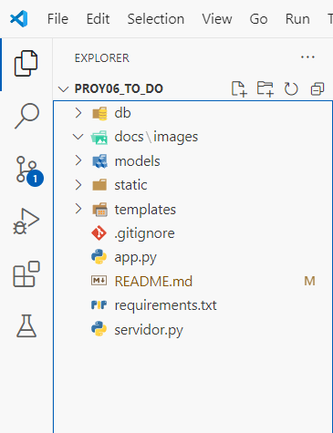
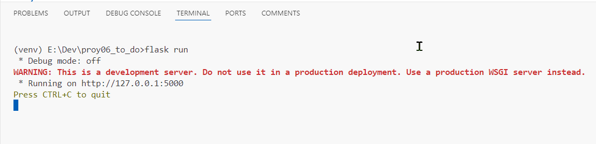
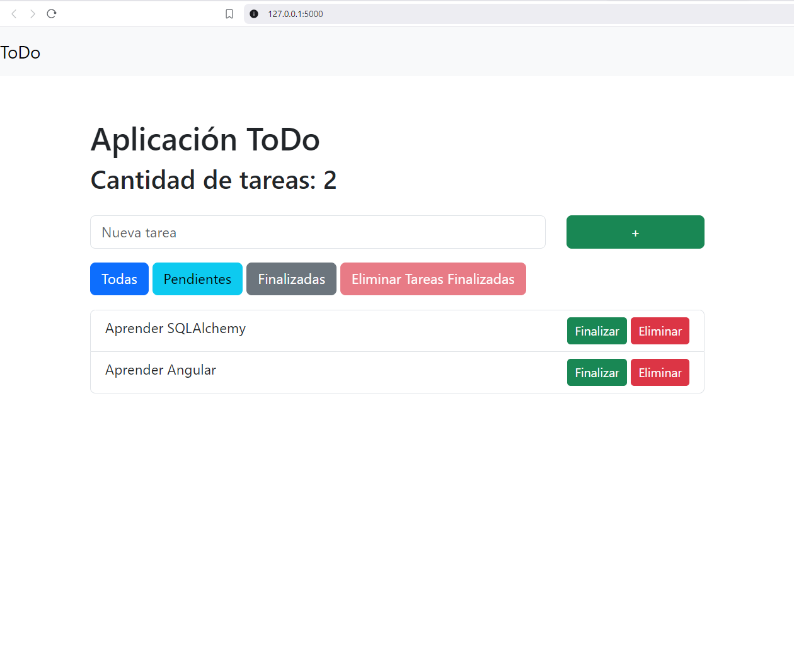

# 1. PROYECTO 6 - Aplicación Web para Tareas por Realizar (ToDo)

Esta es una **aplicación web para gestionar notas y tareas pendientes** desarrollada con **Flask**, un microframework de Python. Permite a los usuarios realizar operaciones CRUD (crear, leer, actualizar y eliminar) en sus notas, ofreciendo una experiencia totalmente interactiva.

---

## Descripción del Proyecto

La aplicación está diseñada para:
- Crear tareas pendientes.
- Editar y eliminar tareas existentes.
- Buscar y visualizar tareas guardadas.
- Almacenar las notas en el navegador o en un servidor (según configuración).

---

## Tecnologías Utilizadas

- **Python 3.x**
- **Flask 3.0.0**
- **HTML, CSS, y JavaScript** para el frontend.

---

## Requisitos Previos

Asegúrate de tener instalado **Python 3.x** en tu sistema. Puedes verificarlo ejecutando:

```bash
python --version
```
o
```bash
python3 --version
```

Si no está instalado, descárgalo desde [python.org](https://www.python.org/downloads/).

---

# 2. Proceso de Instalación

### 1. Instalación de Python
#### Windows:
1. Descarga el instalador desde [python.org](https://www.python.org/downloads/).
2. Durante la instalación, marca la casilla **"Add Python to PATH"**.
3. Finaliza la instalación.

#### macOS:
1. Abre una terminal y ejecuta:
   ```bash
   brew install python
   ```
   (Asegúrate de tener Homebrew instalado).

#### Linux (Debian/Ubuntu):
1. Abre una terminal y ejecuta:
   ```bash
   sudo apt update
   sudo apt install python3 python3-pip
   ```

### 2. Clona este repositorio

```bash
git clone https://github.com/usuario/proyecto6-todo.git
cd proyecto6-todo
```

### 3. Crear un Ambiente Virtual
#### Windows:
```bash
python -m venv venv
```

#### macOS/Linux:
```bash
python3 -m venv venv
```

### 4. Activar el Ambiente Virtual
#### Windows:
```bash
venv\Scripts\activate
```

#### macOS/Linux:
```bash
source venv/bin/activate
```

### 5. Instalar las Dependencias
Ejecuta el siguiente comando para instalar las dependencias listadas en `requirements.txt`:

```bash
pip install -r requirements.txt
```

---

# 3. Ejecución de la Aplicación

1. Asegúrate de que el ambiente virtual esté activado.
2. Ejecuta el archivo principal de la aplicación:

```bash
flask run
```

3. Abre tu navegador web y accede a [http://127.0.0.1:5000](http://127.0.0.1:5000).

---

# 4. Capturas de Pantalla

## 4.1 Estructura de archivos y carpetas



## 4.2 Ejecución de la aplicación



## 4.3 Aplicación en el navegador



---

# 5. Autor

Creado por John Ortiz Ordoñez - johnortizo@outlook.com
**Repositorio en GitHub:** [Enlace al repositorio](https://github.com/usuario/proyecto6-todo)
